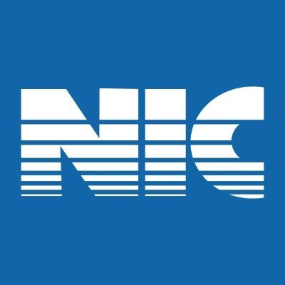

<div align="center">
  
  <h1>📱 Full-Stack WhatsApp Clone</h1>
  <p>A comprehensive, real-time messaging application with WebRTC audio/video calls, media sharing, and a dedicated administrative dashboard.</p>
  
  
  
  
  
  
</div>

<br />

## ✨ Features

### 💬 Core Chat Client (`whatsapp-clone`)
* **Real-time Messaging:** Lightning-fast text messaging powered by Socket.IO.
* **Media & File Sharing:** Upload and share photos, videos, and voice notes seamlessly.
* **WebRTC Calling:** High-quality peer-to-peer Audio and Video calls.
* **Live Status:** Custom presence statuses (Available/Busy) and live online/offline indicators.
* **Contact Management:** Dynamic real-time contact sorting based on recent messaging activity.

### 🛡️ Administrative Portal (`admin-portal`)
* **Real-time Analytics:** Monitor active users and track live network bandwidth (Upload/Download speeds).
* **Database Management:** Instantly clean up chat histories or purge system media while retaining user accounts.
* **User Overview:** Centralized view of all registered users on the system.

### ⚙️ Backend Server (`backend`)
* **Robust API:** Built with Express.js to handle file uploads and authentication.
* **Socket Management:** Advanced WebSocket handling to ensure messages and call signals reach the right peer.
* **Prisma ORM:** Reliable SQLite database management for storing user profiles and chat histories.

---

## 🚀 Getting Started

### Prerequisites
Make sure you have [Node.js](https://nodejs.org/) installed on your machine.

### 1. Install Dependencies
Run the installation command in all three directories:
```bash
# Backend
cd backend
npm install
npx prisma generate

# Client App
cd ../whatsapp-clone
npm install

# Admin Portal
cd ../admin-portal
npm install
```

### 2. Run the Application
You can start all three servers simultaneously using the provided startup script from the root directory:

```bash
./start.sh
```

This will spin up:
- 🟢 **Backend API & Sockets:** `http://localhost:3000`
- 🔵 **Client Chat Interface:** `http://localhost:5173`
- 🔴 **Admin Dashboard:** `http://localhost:5174`

---

## 📂 Project Structure

```
whatsapp-project/
├── admin-portal/       # React (Vite) admin dashboard
├── backend/            # Node.js + Express + Socket.IO + Prisma backend
├── whatsapp-clone/     # React (Vite) main user chat application
├── start.sh            # One-click startup script
└── .gitignore          # Configured to ignore node_modules, .env, and uploads
```

---
<div align="center">
  <i>Built with ❤️ using modern web technologies.</i>
</div>
